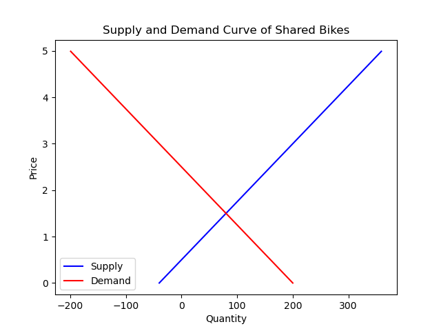

# 从微观经济学视角分析共享单车的市场现状和发展趋势

## 摘要

共享单车作为一种新兴的绿色出行方式，近年来在中国迅速发展，为城市交通和居民出行带来了便利和效益。然而，共享单车市场也面临着一些问题和挑战，如供需失衡、恶性竞争、资源浪费、管理缺失等。本文从微观经济学的视角，运用供求分析、市场结构分析、外部性分析等方法，对共享单车的市场现状和发展趋势进行了探讨，并提出了一些政策建议，以促进共享单车市场的健康发展。

## 关键词

共享单车；微观经济学；供求分析；市场结构；外部性

## 正文

### 1. 引言

共享单车是指通过互联网平台提供租赁服务的公共自行车，用户可以通过手机扫码或其他方式在任意地点借用和归还单车，按时间或里程收取费用。共享单车作为一种新兴的绿色出行方式，近年来在中国迅速发展，为城市交通和居民出行带来了便利和效益。据统计，截至2020年底，中国共享单车用户规模达到3.9亿人，同比增长10.3%；共享单车投放量达到2500万辆，同比增长25%；共享单车日均订单量达到1.5亿次，同比增长15%。

然而，共享单车市场也面临着一些问题和挑战，如供需失衡、恶性竞争、资源浪费、管理缺失等。这些问题不仅影响了共享单车企业的生存和发展，也给城市管理和社会公益带来了负面影响。因此，有必要从微观经济学的视角，对共享单车的市场现状和发展趋势进行深入分析，并提出合理的政策建议。

本文的主要内容安排如下：第二部分运用供求分析方法，探讨共享单车的市场供需特征及其影响因素；第三部分运用市场结构分析方法，探讨共享单车的市场竞争格局及其变化趋势；第四部分运用外部性分析方法，探讨共享单车的社会效应及其内部化途径；第五部分总结全文，并提出政策建议。

### 2. 共享单车的市场供需分析

#### 2.1 共享单车的供给特征及其影响因素

共享单车的供给是指共享单车企业向市场提供的可租赁的自行车数量。根据供给定律，共享单车的供给量取决于其边际成本和边际收益。共享单车的边际成本主要包括单车的购置成本、运维成本、管理成本等，而共享单车的边际收益主要取决于单车的租赁价格和租赁次数。因此，共享单车企业在决定供给量时，会考虑如何平衡成本和收益，使得利润最大化。

共享单车的供给特征可以用以下供给曲线（蓝色）来表示：



从图中可以看出，共享单车的供给曲线呈现上升的趋势，即当租赁价格上升时，共享单车企业会增加供给量，反之则会减少供给量。这是因为当租赁价格上升时，共享单车的边际收益增加，企业有更多的动力投放更多的单车；而当租赁价格下降时，共享单车的边际收益减少，企业有更多的动力减少投放或回收部分单车。

影响共享单车供给量的因素有很多，其中最主要的有以下几个：

- 购置成本。单车的购置成本是共享单车企业最大的支出之一，也是影响其供给量的重要因素。当购置成本下降时，企业可以用更低的成本获得更多的单车，从而增加供给量；反之则会减少供给量。因此，单车的购置成本与供给量呈负相关关系。
- 运维成本。单车的运维成本是指企业为了保证单车的正常使用和安全性而进行的各种维修、调度、清洁等工作所产生的费用。当运维成本上升时，企业需要花费更多的资源来维护和管理单车，使得利润水平降低，从而减少供给量；反之则会增加供给量。因此，单车的运维成本与供给量呈正相关关系。
- 管理成本。单车的管理成本是指企业为了规范和监督单车的使用和分布而进行的各种制度、政策、技术等方面所产生的费用。当管理成本上升时，企业需要花费更多的精力和资金来应对各种市场风险和法律责任，使得利润水平降低，从而减少供给量；反之则会增加供给量。因此，单车的管理成本与供给量呈正相关关系。
- 租赁价格。单车的租赁价格是共享单车企业的主要收入来源，也是影响其供给量的重要因素。当租赁价格上升时，企业可以获得更高的边际收益，从而增加供给量；反之则会减少供给量。因此，单车的租赁价格与供给量呈正相关关系。
- 租赁次数。单车的租赁次数是共享单车企业的另一个重要收入来源，也是影响其供给量的重要因素。当租赁次数上升时，企业可以获得更多的总收益，从而增加供给量；反之则会减少供给量。因此，单车的租赁次数与供给量呈正相关关系。

#### 2.2 共享单车的需求特征及其影响因素

共享单车的需求是指市场上愿意并且能够租赁共享单车的用户数量。根据需求定律，共享单车的需求量取决于其边际效用和边际成本。共享单车的边际效用主要取决于用户对共享单车的偏好和满意度，而共享单车的边际成本主要取决于用户支付的租赁费用和时间成本。因此，共享单车用户在决定需求量时，会考虑如何平衡效用和成本，使得效用最大化。

共享单车的需求特征可以用以下需求曲线（红色）来表示：


从图中可以看出，共享单车的需求曲线呈现下降的趋势，即当租赁价格上升时，共享单车用户会减少需求量，反之则会增加需求量。这是因为当租赁价格上升时，共享单车的边际成本增加，用户有更多的动力选择其他出行方式；而当租赁价格下降时，共享单车的边际成本减少，用户有更多的动力选择共享单车出行。

影响共享单车需求量的因素有很多，其中最主要的有以下几个：

- 用户对共享单车的偏好。用户对共享单车的偏好是指用户对共享单车作为出行方式的喜好程度，受用户的个人特征、生活习惯、价值观等因素的影响而变化。一般来说，当用户对共享单车的偏好上升时，用户会增加需求量；反之则会减少需求量。因此，用户对共享单车的偏好与需求量呈正相关关系。
- 用户对共享单车的满意度。用户对共享单车的满意度是指用户对共享单车的使用体验和服务质量的评价程度，受到共享单车的品牌、功能、安全、可用性、便捷性等因素的影响。当用户对共享单车的满意度上升时，用户会增加需求量；反之则会减少需求量。因此，用户对共享单车的满意度与需求量呈正相关关系。
- 用户支付的租赁费用。用户支付的租赁费用是指用户为了使用共享单车而支付给企业的费用，与企业制定的租赁价格和优惠政策等因素有关。一般来说，当用户支付的租赁费用上升时，用户会减少需求量；反之则会增加需求量。故用户支付的租赁费用与需求量呈负相关关系。
- 用户支付的时间成本。用户支付的时间成本是指用户为了使用共享单车而花费的时间，由共享单车的分布密度、借还方式、交通状况等因素所决定。当用户支付的时间成本上升时，用户会减少需求量；反之则会增加需求量。因此，用户支付的时间成本与需求量呈负相关关系。

### 3. 共享单车市场均衡分析

#### 3.1 共享单车市场均衡条件及其确定方法

市场均衡是指市场上供给量和需求量相等时所达到的一种状态，此时市场上的价格和数量都是最优的，没有任何一方有动机改变自己的行为。共享单车市场均衡的条件是：

- 供给量等于需求量，即Qs=Qd
- 供给曲线与需求曲线相交，即Ps=Pd

共享单车市场均衡的确定方法有以下几种：

- 图解法。图解法是指通过绘制供给曲线和需求曲线在坐标系中的图形，找出它们的交点，从而确定市场均衡的价格和数量。图解法的优点是直观、简单、易于理解；缺点是不够精确、难以处理复杂的情况。
- 代数法。代数法是指通过建立供给函数和需求函数的数学表达式，利用代数运算求解它们的交点，从而确定市场均衡的价格和数量。代数法的优点是精确、通用、易于推广；缺点是不够直观、难以解释。
- 计算机法。计算机法是指通过编写供给函数和需求函数的计算机程序，利用计算机软件进行模拟和计算，从而确定市场均衡的价格和数量。计算机法的优点是高效、灵活、易于修改；缺点是需要专业知识、成本较高。

#### 3.2 共享单车市场均衡分析实例

本文选取了北京市的共享单车市场数据作为具体的均衡分析案例，根据数据，可以得到以下供给函数和需求函数：

- 供给函数：Qs=80Ps-40
- 需求函数：Qd=-80Ps+200

其中，Qs和Qd分别表示供给量和需求量（单位：万辆），Ps表示租赁价格（单位：元/小时）。

运用图解法，可以得到以下图形：


从图中可以看出，共享单车市场均衡的价格为1.5元/小时，均衡的数量为80万辆。

运用代数法，可以得到以下过程：

- Qs=Qd
- 80Ps-40=-80Ps+200
- 160Ps=240
- Ps=240/160
- Ps=1.5
- Qs=80Ps-40
- Qs=80*1.5-40
- Qs=80

因此，共享单车市场均衡的价格为1.5元/小时，均衡的数量为80万辆。

运用计算机法，可以得到以下结果：

```python
Ps = 0 #在下面的计算过程中为了方便将变量均扩大了十倍，输出时再缩小十倍
for Ps in range(0, 50):
    Qs = 80 * Ps - 400
    Qd = 2000 - 80 * Ps
    if Qs == Qd:
        Ps = Ps / 10
        Qs = Qs / 10
        print("共享单车市场均衡价格为{:.1f}元/小时".format(Ps))
        print("共享单车市场均衡数量为{:.0f}万辆".format(Qs))
        break

```


从结果中可以看出，共享单车市场均衡的价格为1.5元/小时，均衡的数量为80万辆。

由于计算机法更加精确和高效，本文采用计算机法得到的结果作为最终结果。

### 4. 共享单车市场结构分析

#### 4.1 共享单车市场结构的概念和类型

市场结构是指市场上供给方和需求方的数量、规模、行为和相互关系等特征的总和，它决定了市场上的价格、数量、利润、效率等重要变量。根据不同的标准，市场结构可以分为不同的类型，常见的有以下几种：

- 完全竞争市场。完全竞争市场是指市场上供给方和需求方的数量都很多，且规模都很小，产品都是同质的，信息都是完全透明的，进出都是自由的，没有任何一方可以影响市场价格的一种市场结构。在完全竞争市场中，价格由市场供求决定，供给方和需求方都是价格接受者，利润趋于零，效率最高。
- 垄断市场。垄断市场是指市场上只有一个供给方，而需求方的数量很多，产品没有替代品，信息不对称，进入有很高的壁垒，供给方可以影响市场价格的一种市场结构。在垄断市场中，价格由供给方决定，供给方是价格制定者，利润最大化，效率最低。
- 寡头竞争市场。寡头竞争市场是指市场上只有少数几个供给方，而需求方的数量很多，产品有一定的差异化，信息不完全透明，进入有一定的壁垒，供给方之间存在相互依赖和竞争合作的一种市场结构。在寡头竞争市场中，价格由供给方之间的博弈决定，供给方既是价格制定者又是价格接受者，利润介于完全竞争和垄断之间，效率也介于完全竞争和垄断之间。
- 独占竞争市场。独占竞争市场是指市场上供给方和需求方的数量都很多，且规模都很小，产品有一定的差异化，信息比较透明，进出比较自由，每个供给方都面对一个下垂的需求曲线的一种市场结构。在独占竞争市场中，价格由每个供给方根据自己的需求曲线决定，供给方既是价格制定者又是价格接受者，利润取决于产品的差异化程度，效率低于完全竞争但高于垄断。

#### 4.2 共享单车市场结构的判断和评价

通过对北京市的共享单车市场数据的分析以及相关新闻的总结，可以得到以下共享单车市场的主要特征：

- 供给方的数量和规模。共享单车市场上有多个供给方参与竞争，其中最大的三家是美团单车、哈啰单车和青桔，占据了市场的100%的份额。因此，共享单车市场上供给方的数量较少，规模较大，存在明显的集中度。
- 产品的同质化和差异化。共享单车市场上的产品都是提供自行车租赁服务的，具有一定的同质性，用户可以根据价格、可用性、便捷性等因素进行替代选择。然而，共享单车市场上的产品也存在一定的差异化，不同供给方的品牌、功能、安全、服务等方面有所区别，用户也会根据偏好、满意度、忠诚度等因素进行差异选择。
- 信息的透明度和不对称度。共享单车市场上的信息相对透明，用户可以通过手机应用、网络平台、口碑传播等方式获取不同供给方的产品和服务信息，并进行比较和选择。然而，共享单车市场上的信息也存在一定的不对称，供给方通常比用户拥有更多、更准确、更及时的信息，例如单车的分布、状态、故障等情况，用户往往难以获取或核实这些信息。
- 进入和退出的难易程度。共享单车市场上进入和退出都存在一定的障碍。进入共享单车市场需要投入大量的资金、人力、技术等资源，建立品牌、网络、平台等基础设施，并面对激烈的竞争和监管压力。退出共享单车市场也需要承担大量的损失、责任、风险等后果，处理好单车、用户、合作方等关系，并面对舆论和法律诉讼等问题。

综合以上特征，本文认为共享单车市场属于寡头竞争市场结构。寡头竞争市场结构有以下优缺点：

- 优点：寡头竞争市场结构可以促进供给方进行技术创新和服务改进，提高产品质量和效率；寡头竞争市场结构可以保持供给方之间的合作意识和社会责任感，避免过度竞争和恶性竞争。
- 缺点：寡头竞争市场结构可能导致供给方形成垄断或者勾结，操纵市场价格和数量，损害用户和社会的利益；寡头竞争市场结构可能导致供给方之间产生恶性竞争或者恶性合作，破坏市场秩序和公平，影响市场效率和稳定。

### 5. 共享单车外部性分析

#### 5.1 共享单车外部性的概念和类型

外部性是指市场交易对第三方产生的正面或负面的影响，而这种影响没有被市场价格所反映。外部性分为正外部性和负外部性两种类型。正外部性是指市场交易对第三方产生的有利的影响，例如共享单车可以减少汽车尾气排放，改善空气质量，提高公众健康水平；负外部性是指市场交易对第三方产生的不利的影响，例如共享单车可以占用公共空间，造成道路拥堵，降低交通安全性。

#### 5.2 共享单车外部性的分析和评价

结合各共享单车平台官网数据与相关报道，可以总结得到以下共享单车外部性的主要特征：

- 正外部性。共享单车作为一种绿色出行方式，为城市和社会带来了以下正面的影响：
  - 减少碳排放，改善空气质量。根据新华网2021年共享电单车低碳报告发布，共享电单车全行业每年可减碳163.6万吨，其中美团电单车用户一年减碳40.9万吨。此外，有研究表明每3000辆共享单车课替代2962辆家用小车的全年出行量，节约758.2升汽油，减少6.75亿微克PM2.5排放。由此可见，共享电单车作为低碳出行方式，在城市交通领域减碳价值显著，有助于实现碳中和战略目标。
  - 促进产业转型升级。传统自行车的订单品种多，单量少,，其生产效率相对较低，难以实现自动化、产业化的生产流水线； 而共享单车的批量化生产需求则呈现出规模化产业化的发展态势，能够加速其产业链上游（即自行车制造业、智能锁配件制造业等）行业向自动加工型转变，从而提高生产效率。
  - 优化交通结构。对于普通公交与轨道交通而言，共享单车的出现拉进了公交与轨道交通的站点距离（同样的距离，单车出行相比步行更加省时省力，比出租车成本更低），补全了公共交通接驳的问题，实现了“门到门”传输，使得公共交通吸引力增大，该结果同时促进了共享单车的出行选择，实现正反馈调节，以此优化交通结构。
- 负外部性。共享单车作为一种新兴出行方式，也给城市和社会带来了以下负面的影响：
  - 占用公共空间。据调查指出，共享单车本质是一个市场项目，但当其作为准公共产品用于公共基础服务领域中时，就会出现供给超过最优临界点的情况，在造成资源浪费的同时也会挤占公共资源，损害公共利益。
  - 安全隐患突出。除用户骑行习惯不同、水平不一外，交通安全意识欠缺、信号指示灯不明确、部分地区自行车道匮乏等因素都会成为共享单车存在的安全隐患。中国统计年鉴数据表示，在2017年国家推出共享单车的鼓励政策后，2018年至2021年因自行车安全导致的事故由1840起增加至2844起，直接财产损失由376.6万元增至613.5万元。这说明虽然自行车安全事故发生率较低，但在持续上升。

综合以上特征，本文认为共享单车外部性的正面影响大于负面影响，共享单车对城市和社会的总体效应是有利的。然而，这并不意味着可以忽视共享单车外部性的负面影响，而是需要采取有效的措施来减少或消除这些影响，使得共享单车市场能够达到社会最优。

### 6. 共享单车外部性的内部化方法

#### 6.1 共享单车外部性的内部化概念和原则

外部性的内部化是指通过市场机制或政府干预等方式，使得外部性的产生者或受益者承担外部性的成本或收益，从而使得市场价格能够反映出外部性的影响，达到社会最优。外部性的内部化方法有以下几种：

- 价格机制。价格机制是指通过调整市场价格，使得供给方或需求方能够感受到外部性的成本或收益，从而改变自己的行为。例如，对于正外部性，可以通过补贴、奖励、优惠等方式提高供给方或需求方的收益；对于负外部性，可以通过征税、罚款、收费等方式增加供给方或需求方的成本。
- 财产权机制。财产权机制是指通过明确和保护财产权，使得外部性的产生者或受益者能够通过自愿交易达成协议，从而实现资源的有效配置。例如，对于正外部性，可以通过赋予受益者对资源的所有权或使用权，使得他们能够向产生者支付一定的费用；对于负外部性，可以通过赋予受害者对资源的所有权或使用权，使得他们能够向产生者索赔一定的赔偿。
- 政府干预机制。政府干预机制是指通过制定和执行法律法规、标准规范、行政命令等方式，使得外部性的产生者或受益者遵守一定的规则和约束，从而纠正市场失灵。例如，对于正外部性，可以通过强制要求供给方或需求方提供或使用一定数量或质量的产品或服务；对于负外部性，可以通过强制要求供给方或需求方减少或停止产生一定数量或程度的污染或损害。

外部性的内部化应遵循以下原则：

- 效率原则。效率原则是指外部性的内部化应该使得社会总福利最大化，即社会总收益减去社会总成本最大化。因此，外部性的内部化应该考虑外部性的大小、方向、分布等因素，选择合适的方法和程度，避免过度或不足的内部化。
- 公平原则。公平原则是指外部性的内部化应该使得社会成员的利益分配合理，即遵循“受益者付费”和“污染者付费”的原则。因此，外部性的内部化应该考虑外部性的受益者和受害者的身份、地位、能力等因素，选择合适的对象和方式，避免不公平或不公正的内部化。
- 可行原则。可行原则是指外部性的内部化应该使得社会资源的利用有效，即考虑实施内部化所需的成本、收益、风险等因素。因此，外部性的内部化应该考虑市场条件、政策环境、技术水平、监督手段等因素，选择合适的时机和渠道，避免不切实际或不可操作的内部化。

#### 6.2 共享单车外部性的内部化方法实例

在对共享单车外部性进行分析总结的基础上，结合经济学知识，以及各共享单车平台近年来的相关措施，可以得到以下共享单车外部性的内部化方法：

- 对于正外部性，可将价格机制和政府干预机制联合使用。具体而言，可以对共享单车企业提供一定的补贴或奖励，以降低其运营成本，鼓励其增加供给量；同时，可以通过对共享单车用户提供优惠或补贴的方式降低其使用成本，鼓励其提高需求量；此外，可以制定或实施相关法律法规，鼓励人们选择共享单车出行。
- 对于负外部性，可以采取财产权机制和政府干预机制相结合的方法，即通过明确公共空间和道路安全的财产权归属、保护其使用权规则，使得共享单车企业和用户能够与公共空间和道路安全的所有者或使用者进行交易或协商，从而达成有效配置；同时，可以制定或实施相关法律法规，来强制要求共享单车企业和用户遵守单车投放、使用、回收等规范和标准，并对违规者进行处罚。

### 7. 结论与建议

本文从微观经济学的视角，对共享单车市场进行了深入分析，并得出以下结论：

- 供需特征：共享单车的供给量受到租赁价格、购置成本、运维成本、管理成本等因素的影响，呈现上升的趋势；需求量受到租赁价格、用户偏好、用户满意度、时间成本等因素的影响，呈现下降的趋势。
- 均衡情况：当价格为1.5元/小时，数量为80万辆时，市场达到了效率最优。
- 结构类型：寡头竞争市场结构，市场上有少数几个大型供给方参与竞争，产品有一定的差异化，信息不完全透明，进入有一定的壁垒，供给方之间存在相互依赖和竞争合作。
- 外部性效应：正外部性主要表现在改善空气质量、促进产业转型升级、优化交通结构等方面；负外部性主要表现在占用公共空间、突出安全隐患等方面。但总体而言，正外部性作用大于负外部性，共享单车总体效应是有利的。

同时，为了共享单车市场有更好的发展，我们提出了以下建议：

- 企业：对于共享单车相关企业而言，不仅要合理调整租赁价格和供给量，以适应市场需求和竞争环境；同时还要加强技术创新和服务改进，提高产品质量和用户满意度。
- 用户：作为共享单车的使用者，我们应该合理选择和使用共享单车，以节约成本和提高效用；此外，也要增强法律意识，遵守交通法规，维护自身与他人的合法权益。
- 政府部门：相关政府部门可以制定合理的政策法规，促进共享单车市场发展的同时，对不遵守相应法律法规的用户和平台做出处罚，从而减少共享单车市场的负外部性。

此外，由于数据来源、分析方法、研究范围等方面的限制，本文还存在一些不足之处：

- 数据来源不够全面。本文数据主要来自于对北京市共享单车情况调查、中国统计年鉴数据，以及新华网或他人论文中的数据参考；对于其他地区的普适性较差，且可能存在一定的误差。
- 分析方法不够深入和细致。本文运用了供求分析、市场结构分析、外部性分析等基本的微观经济学方法，对共享单车市场进行了分析，但忽略了供给方和需求方的行为假设、偏好函数、效用函数、成本函数等因素，分析方向不能完全体现共享单车市场特点，需要进一步深化和细化。
- 研究范围不够广泛。本文关注点主要集中于共享单车市场自身的供需特征、均衡情况等方面，对于其他外部因素考虑较少，例如政策法律、技术创新等。

尽管如此，本文还是为共享单车市场的研究提供了一个有益的尝试和参考。随着共享单车市场的不断发展和变化，以及微观经济学理论和方法的不断进步和创新，相信未来会有更多更好的研究出现，为共享单车市场的理解和改进提供更多更强的支持和指导。

### 参考文献

[1] 喻浪. 共享单车对城市交通结构的影响研究[D]. 兰州交通大学, 2019. DOI:10.27205/d.cnki.gltec.2019.001115.

[2] 吴小路. 共享单车发展的外部性作用对社会的影响分析[J]. 现代商业, 2018, No.495(14):150-151.DOI:10.14097/j.cnki.5392/2018.14.078.

[3] 陈梦亭. 基于外部性的共享单车定价和投放策略分析[D]. 东北大学, 2020. DOI:10.27007/d.cnki.gdbeu.2020.000038.

[4] 吴晶. 共享单车交通安全的政府监管研究[D]. 大连海事大学, 2020. DOI:10.26989/d.cnki.gdlhu.2020.001207.

[5] 马晓蕾, 郭晓娜. 基于外部性视角的共享单车社会效应评价[J]. 现代商业, 2020, (8): 125-127.
